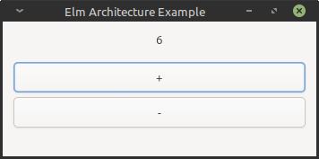

# Rust Elm Architecture Example

A simple implementation of the Elm Architecture in Rust.

---

This uses Gtk to create a simple gui application that displays a label and two buttons. The buttons allow you to increment and decrement a count which is displayed in the label.

---

I created this to help me understand ownership and borrowing so it only implements a subset of the Elm architecture i.e. _this is **not** a reference implementation_ as it is missing things like commands and subscriptions.

I have also made some changes to the design which I felt were more appropriate to Rust e.g. the update function mutates the application state instead of returning an updated copy of the model.
